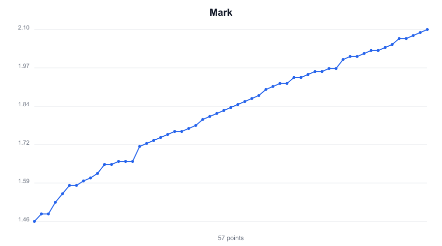

# Wikipedia Table Charter

A command-line tool that reads a web page (e.g. a Wikipedia article), finds a
table, detects a **numeric column**, and plots it to a **PNG image**.

Built with **TypeScript** + **NestJS** (`nest-commander`). It is a CLI — there
is no server and no frontend.



> This is my solution to the Detector Inspector engineering challenge.
> The original brief is in [CHALLENGE.md](CHALLENGE.md); the design write-up,
> assumptions and testing approach are in **[SOLUTION.md](SOLUTION.md)**.

## Requirements

- **Node.js 18.17+** (uses the built-in global `fetch`; developed on Node 22)
- npm

## Setup

```bash
npm install
```

## Usage

Run directly from TypeScript (no build step needed):

```bash
npm run chart -- "https://en.wikipedia.org/wiki/Women%27s_high_jump_world_record_progression"
```

By default the output is named after the page, e.g.
`output/Women's_high_jump_world_record_progression.png`. Override the path with
`-o`:

```bash
npm run chart -- "https://en.wikipedia.org/wiki/List_of_tallest_buildings" -o buildings.png
```

The tool auto-detects the numeric column. To plot a specific one, pass
`-c/--column` (matched by header, case-insensitive):

```bash
npm run chart -- "https://en.wikipedia.org/wiki/All-time_Olympic_Games_medal_table" -c "Gold"
```

If the column isn't found, the error lists the available numeric columns.

Or build once and run the compiled CLI:

```bash
npm run build
node dist/main.js chart "<wikipedia-url>" -o output/chart.png
```

The tool prints which column it selected, e.g.:

```
✔ Plotted "Mark" (57 points) → /path/to/output/chart.png
```

## Testing

```bash
npm test          # run all unit + BDD tests (30 tests)
npm run test:cov  # with coverage report
```

The suite combines **TDD** unit tests for the pure logic (number parsing,
column selection, table parsing incl. rowspan/colspan, SVG rendering) with a
**BDD** feature (`test/features/chart-generation.feature`, via `jest-cucumber`)
that exercises the full pipeline end-to-end and asserts a real PNG is written.

## Project layout

```
src/
  main.ts                    CLI bootstrap (nest-commander)
  app.module.ts              Dependency-injection wiring
  cli/chart/chart.command.ts `chart <url> [-o path]` command
  core/
    chart-pipeline.service.ts        Orchestrates the stages
    fetcher/page-fetcher.service.ts  URL → HTML
    parser/table-parser.service.ts   HTML → tables (handles merged cells)
    parser/number.util.ts            Cell → number (footnotes, units, …)
    parser/numeric-column-selector.service.ts  Pick the numeric column
    chart/svg-chart.renderer.ts      Data → SVG (pure)
    chart/png-writer.service.ts      SVG → PNG (sharp)
    **/*.types.ts                    Interfaces (colocated per module)
test/features/               BDD feature + step definitions
```

## Scripts

| Command | Description |
|---------|-------------|
| `npm run chart -- <url>` | Run the CLI in dev (ts-node) |
| `npm run build` | Compile to `dist/` |
| `npm start` | Run the compiled CLI (after `npm run build`) |
| `npm test` | Run unit + BDD tests |
| `npm run test:cov` | Tests with coverage |
| `npm run lint` | ESLint (with `--fix`) |
| `npm run format` | Prettier |

## Notes

A project-scoped `.npmrc` pins the public npm registry, so `npm install` works
regardless of any private registry configured globally on your machine.

See **[SOLUTION.md](SOLUTION.md)** for design decisions, the column-selection
heuristic, documented assumptions, and known trade-offs.
