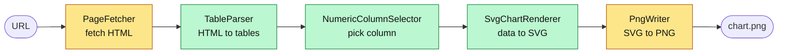
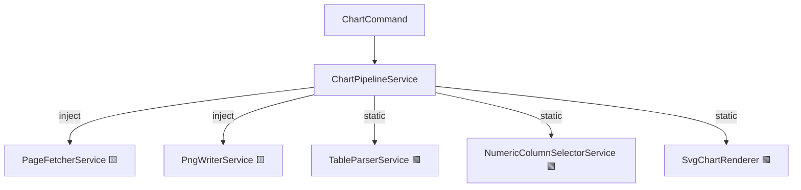
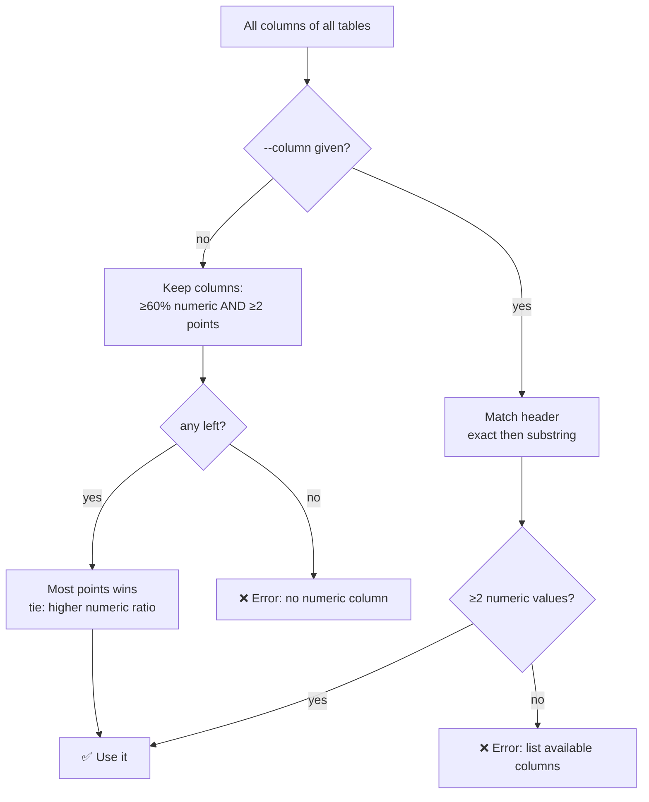
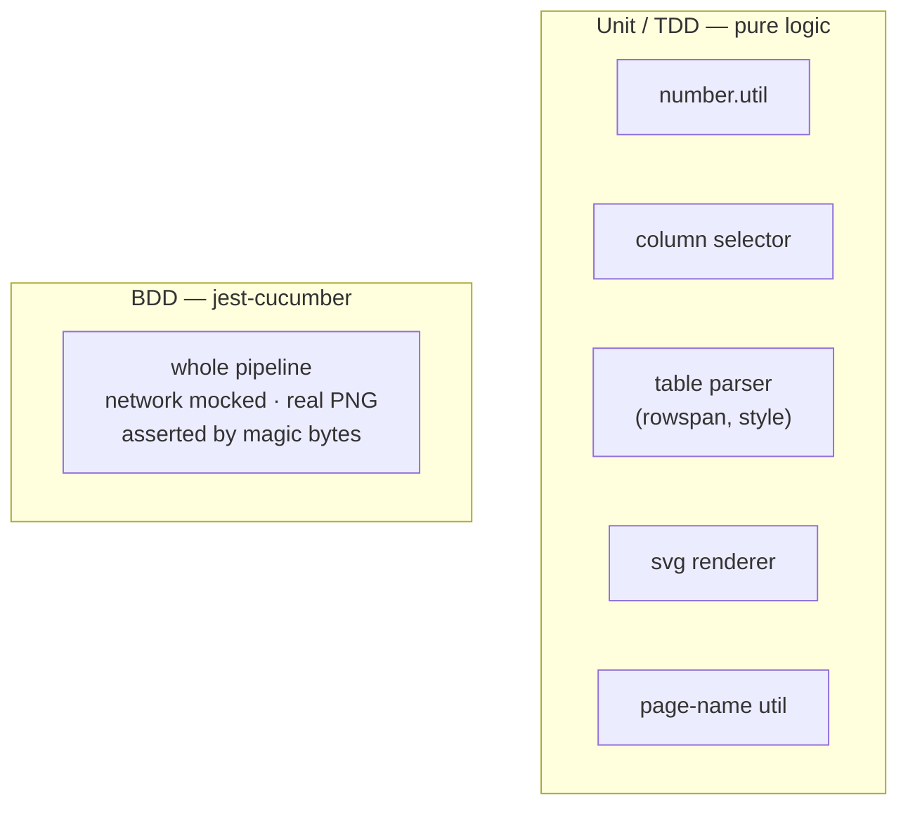

# Solution — Wikipedia Table Charter

**URL in → PNG out.** Scans a Wikipedia page for tables, detects a numeric
column, and plots it. Sample ([Women's high jump](https://en.wikipedia.org/wiki/Women%27s_high_jump_world_record_progression)) →
[`docs/sample-output.png`](docs/sample-output.png) (1.46 m → 2.10 m, 57 records).

---

## 1. Pipeline

Each stage is one small unit; only the two ends touch the outside world.



🟨 I/O (network / disk)  🟩 pure (deterministic)

| Stage | File |
|-------|------|
| Fetch | `core/fetcher/page-fetcher.service.ts` |
| Parse | `core/parser/table-parser.service.ts` (cheerio) |
| Numbers | `core/parser/number.util.ts` |
| Select | `core/parser/numeric-column-selector.service.ts` |
| Render | `core/chart/svg-chart.renderer.ts` |
| Rasterise | `core/chart/png-writer.service.ts` (sharp) |
| Orchestrate | `core/chart-pipeline.service.ts` |
| CLI | `cli/chart/chart.command.ts` (nest-commander) |

---

## 2. Composition (NestJS DI)

Booted as a **console app context — no HTTP server**. Async/IO stages are
injectable services (mockable in tests); pure stages are static classes (no DI).



---

## 3. Choosing the numeric column

No hard-coded column names. `-c/--column` overrides the heuristic.



---

## 4. Handled HTML quirks

Real issues on the sample page, each fixed in the parser + covered by a test:

| Quirk | Effect if ignored | Fix |
|-------|-------------------|-----|
| `rowspan`/`colspan` | a date leaks into the numeric column → false spikes | expand spans into a rectangular matrix |
| inline `<style>`/`<script>` | CSS text spliced into a cell | strip those nodes before reading text |
| footnotes/units/`2,050`/`−` | cell won't parse | normalise, then take first number |
| durations `2:55:18`, `3:43.13` | only the leading number kept | convert to total seconds |

Output name + chart title come from the URL's page name
(`page-name.util.ts`): default `output/<page>.png`, title `"<page> — <column>"`.

---

## 5. Testing (TDD + BDD) — `npm test`, 44 tests



```gherkin
Scenario: Plotting a record-progression table
  Given a page containing a table with a numeric "Height (m)" column
  When I run the chart pipeline for that page
  Then a PNG image file is produced
  And the chart is titled after the numeric column
  And the chart contains one point per row
```

---

## 6. Assumptions & trade-offs

- Input is a server-rendered page with ≥1 `<table>`; **JS-rendered SPAs are out
  of scope** (no `<table>` in raw HTML).
- X axis is **row order** — record tables are already time-ordered.
- **Hand-rolled SVG + `sharp`** over `node-canvas`: pure, easy to test, no native
  build step (single `npm install`).
- **Next:** date-aware X axis; richer chart lib behind `SvgChartRenderer`; fetch
  retries/timeouts; more BDD scenarios.
